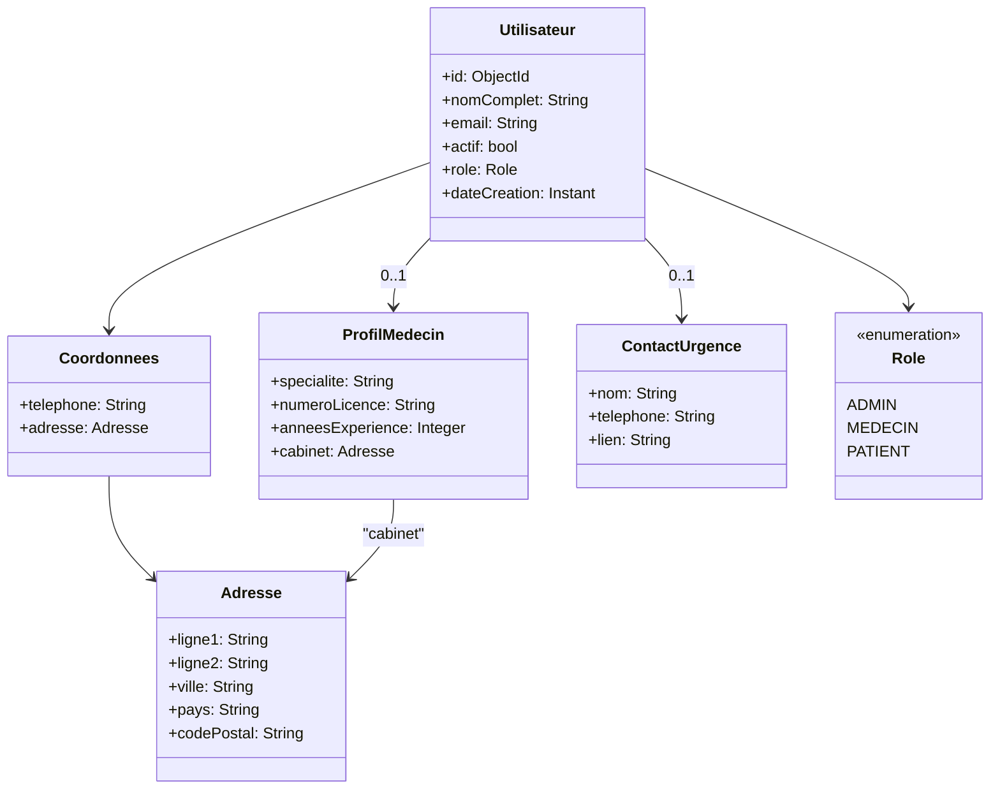
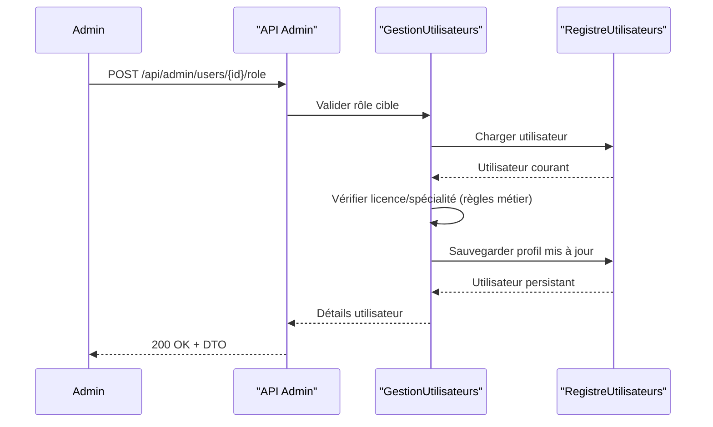
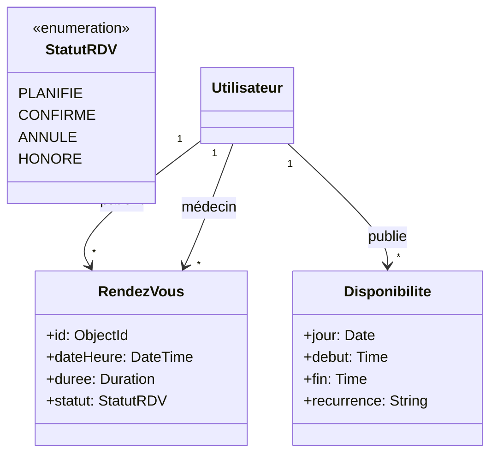
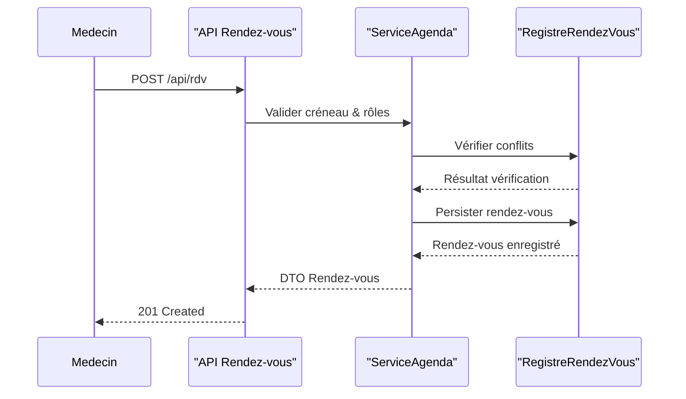
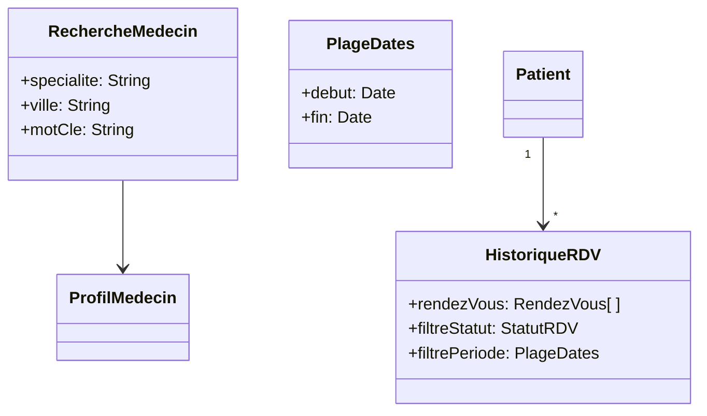
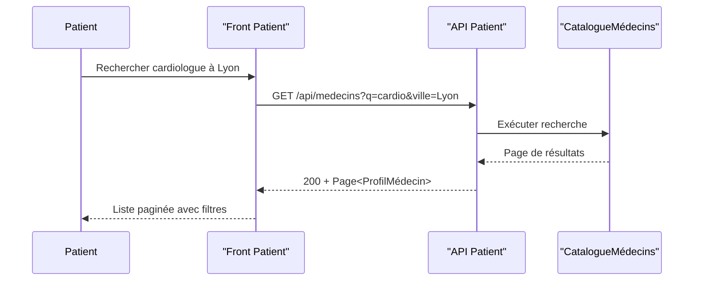
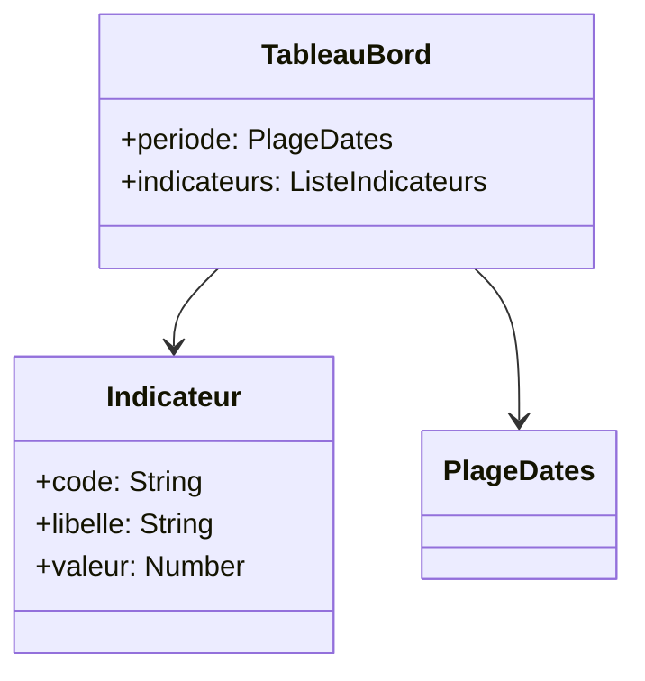
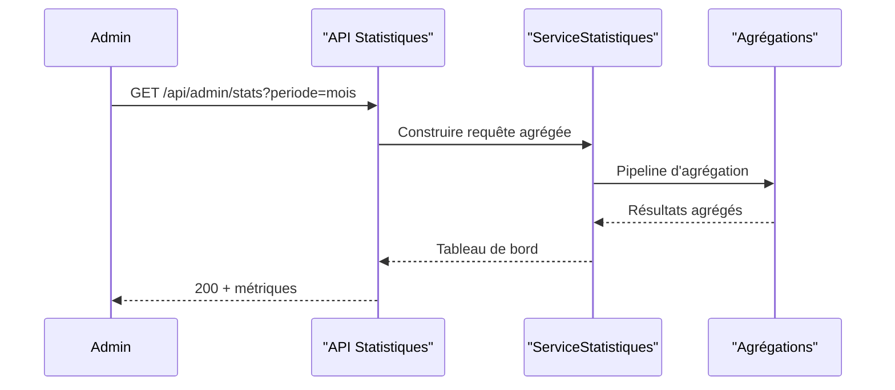
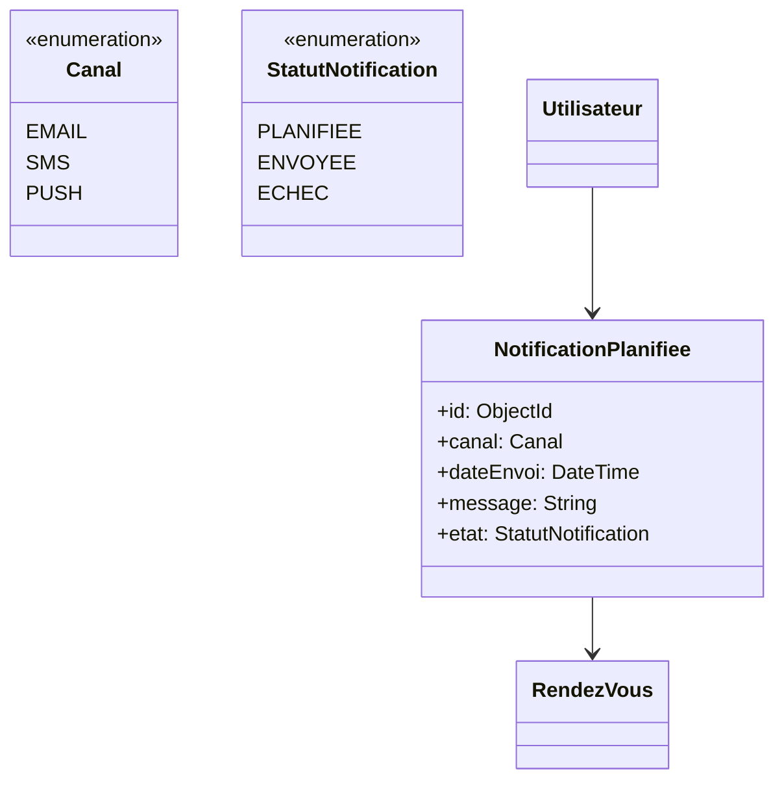
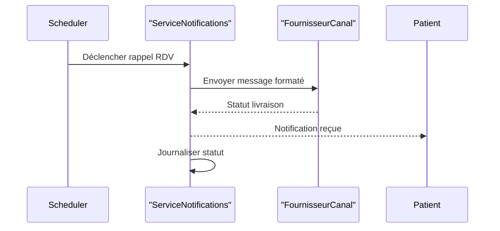

# Plan produit — 5 sprints

Ce plan couvre le périmètre backend prioritaire ainsi que les jalons préparatoires pour le frontend. Les estimations sont en points (1 pt ≈ 1/2 journée). Les statuts reflètent la situation cible à la fin du sprint concerné.

## Sprint 1 — Authentification & Administration des utilisateurs

### Sprint backlog

| User story | Tâches | Responsable | Priorité | Estimation | Statut |
|------------|--------|-------------|----------|------------|--------|
| En tant qu'admin, je me connecte pour accéder à l'espace d'administration. | Vérifier flux login/refresh JWT, gérer erreurs 401/403, tests d'intégration minima. | Backend | Haute | 5 | À faire |
| En tant qu'admin, je liste les utilisateurs avec filtres/pagination. | Nettoyer modèle `Utilisateur`, implémenter filtre q/role/active/provider, sécuriser tri. | Backend | Haute | 8 | À faire |
| En tant qu'admin, j’active/désactive un utilisateur. | Ajouter routes de désactivation/réactivation, messages d’erreur FR, logs sobres. | Backend | Haute | 5 | À faire |
| En tant qu'admin, je change le rôle d’un utilisateur. | Validation spécialité/licence, conversion profil, test unitaire service. | Backend | Haute | 8 | À faire |
| En tant qu'admin, j’exporte la liste en CSV. | Générer CSV (UTF-8), exposer endpoint sécurisé, documenter format. | Backend | Moyenne | 3 | À faire |
| En tant qu'admin, je gère les profils via l’UI. | Préparer documentation API et prompt frontend. | Backend | Haute | 5 | À faire |

### Cas d'utilisation (Sprint 1)

```mermaid
%% Sprint 1 - Cas d'utilisation principaux
%% Légende : flèches pointillées = include
ucDiagram
    actor Utilisateur
    actor Admin as "Administrateur"
    Utilisateur <|-- Admin
    rectangle "Gestion utilisateurs" {
        usecase UC1 as "S'authentifier"
        usecase UC2 as "Gérer les comptes"
        usecase UC3 as "Exporter les utilisateurs"
    }
    Admin --> UC2
    Admin --> UC3
    UC2 ..> UC1 : <<include>>
    UC3 ..> UC1 : <<include>>
```

### Diagramme de classes fonctionnel (Sprint 1)



### Diagramme de séquence (Sprint 1)



### Remarques clés

- Validation bean côté API (messages FR cohérents), règles métier encapsulées au service.
- Pagination/tri/filtre sur la recherche admin (sort sécurisé sur champs autorisés).
- Export CSV UTF-8, séparateur virgule, en-têtes documentés.
- Pas de suppression dure exposée à l’UI : désactivation par défaut, suppression définitive réservée aux cas légaux.
- Journalisation : niveau INFO pour succès, WARN pour rejets métier, jamais de données sensibles.

## Sprint 2 — Rendez-vous (Agenda Médecin + Admin)

### Sprint backlog

| User story | Tâches | Responsable | Priorité | Estimation | Statut |
|------------|--------|-------------|----------|------------|--------|
| En tant que médecin, je gère mes disponibilités. | Modèle Disponibilité, endpoints CRUD, validations chevauchement. | Backend | Haute | 8 | Terminé |
| En tant que médecin, je visualise mon agenda jour/semaine. | API de lecture agenda (filtre date), projection DTO. | Backend | Haute | 5 | Terminé |
| En tant qu'admin, j’assiste sur la planification. | Endpoints d’édition admin (impersonation contrôlée). | Backend | Moyenne | 5 | Terminé |
| En tant que médecin, je reçois des alertes en cas de conflit. | Règles de validation métier + notifications futures (event bus). | Backend | Moyenne | 3 | Terminé |

### Diagrammes (Sprint 2)

```mermaid
%% Cas d'utilisation Sprint 2
ucDiagram
    actor Utilisateur
    actor Medecin as "Médecin"
    actor Admin as "Administrateur"
    Utilisateur <|-- Medecin
    Utilisateur <|-- Admin
    rectangle Agenda {
        usecase UC1 as "S'authentifier"
        usecase UC2 as "Gérer disponibilités"
        usecase UC3 as "Planifier un rendez-vous"
    }
    Medecin --> UC2
    Medecin --> UC3
    Admin --> UC3
    UC2 ..> UC1 : <<include>>
    UC3 ..> UC1 : <<include>>
```





### Remarques

- Règles de chevauchement temps forts (créneau ⊂ disponibilités, pas de conflits sur même médecin).
- Prévoir statuts multiples (planifié, confirmé, annulé) pour futurs rappels.
- Pagination/filtre sur listing agenda (jour/semaine, médecin, statut).

## Sprint 3 — Espace Patient

### Sprint backlog

| User story | Tâches | Responsable | Priorité | Estimation | Statut |
|------------|--------|-------------|----------|------------|--------|
| En tant que patient, je m'inscris et gère mon profil. | Réutiliser /api/auth/register, ajouter endpoint profil patient, validation urgence. | Backend | Haute | 5 | Terminé |
| En tant que patient, je recherche un médecin par spécialité. | Endpoint recherche médecins (texte, spécialité, ville), pagination. | Backend | Haute | 5 | Terminé |
| En tant que patient, je prends rendez-vous. | Requêtes création RDV côté patient, validation droits, confirmation e-mail (à venir). | Backend | Haute | 8 | Terminé |
| En tant que patient, je consulte mon historique. | Endpoint liste RDV passés/futurs, filtres statut/date. | Backend | Moyenne | 5 | Terminé |

### Diagrammes (Sprint 3)

```mermaid
ucDiagram
    actor Utilisateur
    actor Patient
    Utilisateur <|-- Patient
    rectangle "Espace Patient" {
        usecase UC1 as "S'authentifier"
        usecase UC2 as "Mettre à jour mon profil"
        usecase UC3 as "Chercher un médecin"
        usecase UC4 as "Prendre rendez-vous"
        usecase UC5 as "Consulter mon historique"
    }
    Patient --> UC2
    Patient --> UC3
    Patient --> UC4
    Patient --> UC5
    UC2 ..> UC1 : <<include>>
    UC4 ..> UC1 : <<include>>
    UC5 ..> UC1 : <<include>>
```





### Remarques

- Accessibilité front (labels FR, messages d’erreur explicites).
- Pagination, tri et filtres systématiques.
- Confirmation de rendez-vous et annulation respectent le statut métier.

## Sprint 4 — Statistiques & Rapports

### Sprint backlog

| User story | Tâches | Responsable | Priorité | Estimation | Statut |
|------------|--------|-------------|----------|------------|--------|
| En tant qu'admin, je visualise des indicateurs clés. | Agrégations Mongo (nb RDV, taux annulation), endpoint /api/admin/stats. | Backend | Haute | 5 | Terminé |
| En tant qu'admin, j’exporte les données analytiques. | Export CSV/PDF, filtres temporels (jour, semaine, mois). | Backend | Moyenne | 5 | Terminé |
| En tant que médecin, je consulte mes statistiques personnelles. | Endpoints restreints rôle médecin (RDV par statut, temps moyen). | Backend | Moyenne | 5 | Terminé |

### Diagrammes (Sprint 4)





### Remarques

- Filtrage temporel (jour/semaine/mois, période personnalisée) + rôle.
- Exports CSV alignés sur doc, colonnes FR.
- Préparer structure pour intégration BI ultérieure.

## Sprint 5 — Notifications & Pré-diagnostic IA

### Sprint backlog

| User story | Tâches | Responsable | Priorité | Estimation | Statut |
|------------|--------|-------------|----------|------------|--------|
| En tant que patient, je reçois des rappels de rendez-vous. | Scheduler, canaux (email/SMS placeholders), gestion opt-in. | Backend | Moyenne | 8 | Terminé |
| En tant que médecin, je paramètre mes notifications. | Endpoints préférences notifications, validation business. | Backend | Moyenne | 5 | Terminé |
| En tant que patient, j’obtiens un pré-diagnostic léger. | Collecte symptômes, appel modèle IA (stub), garde-fous éthiques. | Backend | Basse | 8 | Terminé |

### Diagrammes (Sprint 5)





### Remarques

- Système extensible (pattern Publisher/Subscriber) pour nouveaux canaux.
- Pré-diagnostic IA : règles éthiques, message légal « ne remplace pas un avis médical ».
- Tests unitaires sur règles de notifications, tests d’intégration sur scheduler.

---

## Synthèse transversale

- Tous les endpoints doivent exposer des erreurs structurées (message, détails) en français.
- Les validations métiers sont concentrées dans les services de domaine pour respecter SOLID.
- Pagination, tri et filtres documentés et homogènes sur toute l’API.
- Export CSV : toujours horodatage ISO-8601, séparateur virgule, encodage UTF-8.
- Préparer les hooks d’événements (publication domaine) pour les notifications futures.
